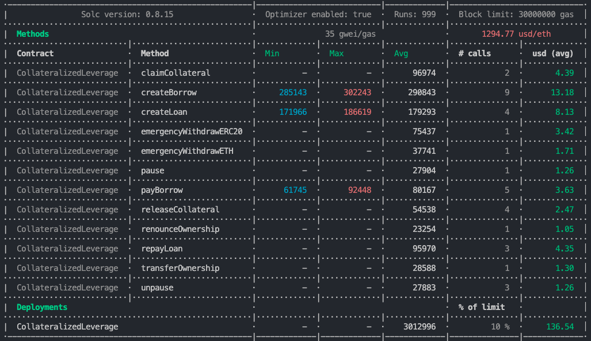
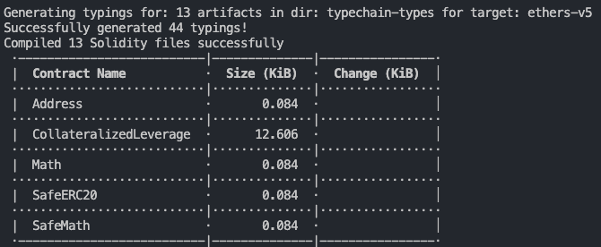
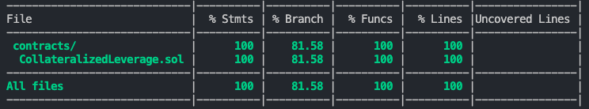

# Solidity Coding Challenge

## Description

### Collateralized Leverage contract

We want to create a contract that allows people to leverage their token and buy other tokens.

### Workflow

- Assumption
People can deposit one (stable) coin (token x) into a pool (token X to token A) [i.e. money can be sent to contract itself.]

There is a fixed return rate for money borrowed in the pool (say 5% per month) [this can be hard coded]

there is a fix rate (or upgradable via function or oracle) between token X and token A (this is a simplification)

- Flow
Borrower can deposits x amount of token A and lock them for a certain period

Borrower receives 50% of value of token A into token X

Idea is that borrower is able to use the token x to invest in other currency and only having to repay the principal (and interests) at expiration date (when the lock period ends)

- 2 outcomes can happen
  - Scenario 1 Borrower can pay back the loan

    - At any time before the expiration the borrower send back amount of token x borrowed plus interests until lock period (10% per month)

    - The collateral (token A) is released to him/her

    - Happy path

  - Scenario 2 Borrower can’t pay back the loan

    - Borrower doesn’t payback within the deadline

    - Lender can decide to take collateral at any time

    - Borrower can decide to pay back at “at the time” interest (so 5% over a longer period => lock until period + time of repayment) and unleash the collateral

- Why is it useful?

 Imagine it’s January 2021 you have eth and you want to hold. But you also want to leverage it in order to buy, say, Shiba. You can deposit 2 Eth and get 1000 usdt (market price is one eth == 1000usdt and 0,5 collateral multiplier). You lock the Eth for one year. You then use 1000usdt to buy shiba at 0.00000002 usdt. Actually something like 50bln shiba at March’s market price. Now is November. Eth is worth 4500 usdt, and shiba is worth (0.00008845usdt), roughly 4,5mln usdt. You convert part of shiba to 1000usdt plus fees and return it.
 Now thank to the leverage you not only made 4,5mln, but also got the 2 eth (minus 1k+fees usdt) appreciation!

## Bonus questions

 - Assuming that the exchange rate between token A and token X will be the same. What is the maximum period it is advised to issue a loan? I.E. Is there a moment where collateral will be lower than principal+interest?
 - Can we add a check that allows the lender to take the collateral before the end of the lock period in case the previous situation applies?

### Expected delivary

Solidity contract (can be published online on testnet or delivered as a git project). No additional files are required. Tests are welcome.

## Additional Assumption

- The Collateral will be Ether
- The token ERC20 Stablecoin (for the test used USDC, because the Liquidity between USDC/ETH is the more bigger liquidity pool of UniSwap)
- Using UniSwap like oracle for getting the Rate between ETH / USD
- The interest rate is 5% per month for Lenders
- The interest rate is 10% per month for Borrowers
- the Lender and Borrower only can create a unique Loan and Borrow

## How to use

### Environment Variables

Config this .env file before to run the test

- `MNEMONIC` - The mnemonic of the account that will be used to deploy the contract
- `INFURAKEY` - Infura API Key
- `PRIVATE_KEY` - Private Key of the account that will deploy the contract
- `ETHERSCAN_API_KEY` - Etherscan API Key
- `COINMARKETCAP_API_KEY` - CoinMarketCap API Key
- `ALCHEMY_KEY` - Alchemy API Key for Fork-Mainnet (Please remember to enable Fork-Mainnet for Simulate the execution in Mainnet)

### Install

```bash
npm install
```

### Test

```bash
npm run test
```

### Deploy in Local Network

```bash
npm run deploy-test # for  Fork-Mainnet
```

### Deploy in Mainnet

```bash
npm run deploy-mainnet
```

## Reports

### Gas Report



### Size Report



### Coverage Report

[Coverage Report](coverage/index.html)

**Is Important to Mentions the Coverage raised 100% of all Code and 81% of all if/else and require (branches)**


